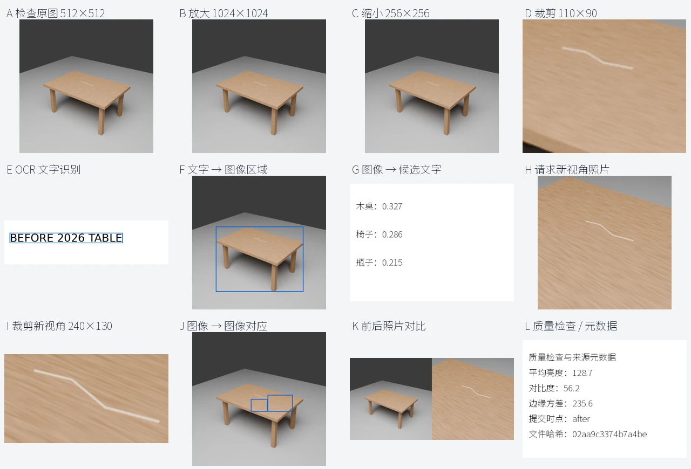

# ResolveAI

[**20 人、预计 5–10 分钟：中英双语人工实验与模型评测**](docs/human_study.zh-CN.md)

[**中文可视化 Demo：不同工具操作的实际结果**](docs/demo/README.zh-CN.md)

[**Benchmark 修复：具体题目、真实视角与中文审核**](docs/benchmark_v04.zh-CN.md)

[**模型答题与工具接口的实际检查**](docs/results/interface_checks.zh-CN.md)

[**三模型复测：具体回答、搜证失败与题池修复**](docs/results/repaired_checks.zh-CN.md)

[首轮候选评测进度（历史）](docs/results/evaluation_progress.md)



A multi-turn visual evidence environment for training and evaluating agents that
choose what to inspect, request and cite. Verdicts are `Supported`, `Refuted` and
`Need more evidence`. Visual state changes do not establish liability.

## Environment

The policy receives released pixels, public provenance and its remaining budget.
Its persistent conversation contains actual assistant function calls and actual
tool responses. Private world state, annotations and unreleased file paths stay
outside the model process. Crops and zoom retain source coordinates; enlarging a
preview cannot recover detail. Requests match object/time/view without changing
the underlying world. Trusted trainers can fork the same state to compare actions.

Tools include inspect, crop, zoom in/out, OCR, compare, request_photo, image quality,
metadata, text-to-image grounding, image-to-image grounding, image-to-text candidate
ranking and finish. OCR and grounding run on pixels using frozen models; their
outputs are proposals, not annotations or identity truth. See the
[environment contract](docs/environment.md) for costs, providers and safeguards.

Terminal evaluation supports alternative sufficient evidence sets, region coverage,
time checks and decisive counterexamples. Trajectories store native messages and
content-addressed image blobs. SFT and action preference helpers exclude private
supervision from prompts and reject unreviewed/proxy traces by default.

## Data and evaluation

The current **v0.4.1 curation pool has 478 claim combinations and 1,912 release
configurations**, built from 188 public state queries and 226 multiview source
sequences. Normal references, explicit targets and resolution/wording controls
make failures easier to diagnose. Independent visual-sufficiency review is still
required before formal evaluation; these materials are not training supervision.
See the [repair guide](docs/benchmark_v04.zh-CN.md).

The historical resolution-release benchmark contains **300 source images across all
15 MVTec AD categories and 1,200 availability cases**, excluding the 24 pilot images and one compatibility image used for development. See
the [earlier pilot](docs/results/public_pilot.md). No future self-collected data is
assumed. Static and full multi-turn policies use frozen Qwen3-VL-8B,
Qwen2.5-VL-7B and InternVL3.5-8B checkpoints with the same interactive tool pool,
costs and budget. See [benchmark protocol](docs/benchmark.md) for access conditions,
model adapters, reproducibility and the limits of the quality-proxy metric.

Public images test anomaly recognition and controlled resolution release. They
are not same-object before/after photographs. Blender produces immutable-state,
multi-view before/after scenes separately; the initial six-image scene is an
integration fixture with unreviewed geometric annotations. Neither these scenes
nor public quality-proxy scores establish simulation-training transfer.
[Data protocol](docs/data_protocol.md) describes annotation and split requirements.

## Run

```bash
python -m pip install -e '.[model,ocr]'
python -m unittest discover -s tests -v
python -m resolveai.server /private/case.json /private/assets --conversation --budget 12 \
  --grounding-root /private/frozen-tools
```

The JSONL server emits public observations and accepts
`{"name":"crop","arguments":{"image_id":"photo","bbox":[0,0,100,100]}}`.
Finish citations require released `image_id`, source-pixel rectangles and source
time. `source_id` is provenance and may name an unreleased original; cite a
preview with its own released ID. `--allow-forks` is for trusted training controllers; branching is not a policy
tool. Run untrusted policies in a separate account/container without access to
private assets: a subprocess alone does not enforce filesystem isolation.

[Execution status](docs/status.md) records the allocated GPUs and storage. Keep
weights, datasets and trajectories outside Git. Store one pinned snapshot per
model and one deduplicated image blob per run, with compact manifests and summaries.

证据链协议、公开多视角数据与 world model 的研究范围见 [中文研究协议](docs/research_protocol.zh-CN.md)。
