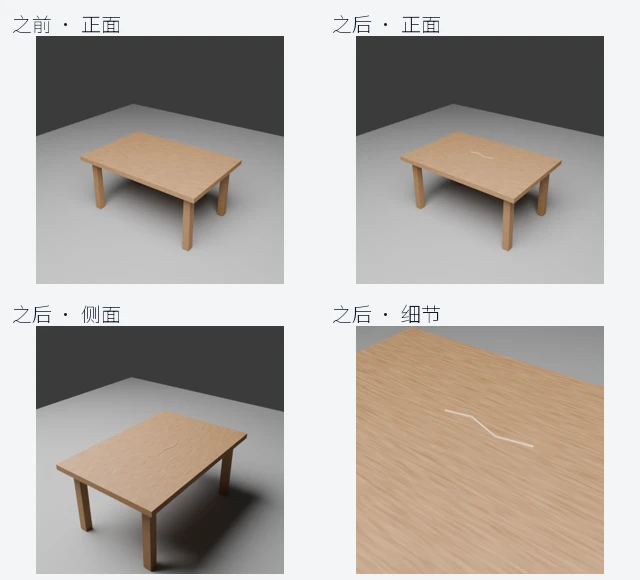
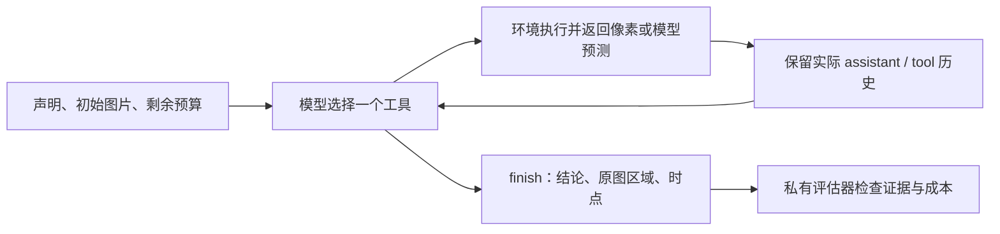

# 中文 Demo：不同工具操作会返回什么？

ResolveAI 是一个**多轮视觉证据环境**。模型看到已释放的图片、来源、时点和预算，
每轮选择一个工具；环境返回真实的工具结果，再进入下一轮。最后输出
`Supported`（支持）、`Refuted`（反驳）或 `Need more evidence`（需要更多证据），并引用原图区域和时点。

本页图片来自 **Blender 状态驱动渲染**，不是现实损坏案件；OCR 卡片是程序生成的文字示例。
为展示全部工具，下方 14 步操作由脚本指定，OCR 和 grounding 结果则由实际模型计算。
它们不是伪造的 MLLM 自动决策轨迹。演示预算为 30，正式公开数据评测预算为 12。

## 同一场景，不同视角与时点



上排是之前／之后的正面；下排是之后的侧面／细节。`request_photo` 释放已有材料，
底层物品状态保持不变。仿真使用显式几何、状态和相机渲染像素；首阶段不让生成式图片编辑充当真实证据。

## 操作结果一览


| 图中编号 | 操作 | 实际返回与用途 | 费用 |
|---|---|---|---:|
| A | `inspect` 检查原图 | 返回已释放的 `after-front` 像素，显示尺寸 512×512 | 1 |
| B | `zoom` 放大 2 倍 | 返回新的 view_id，显示尺寸 1024×1024；不补出新细节 | 1 |
| C | `zoom` 缩小到 0.5 倍 | 返回 256×256 像素；再次放大不能恢复丢失的信息 | 1 |
| D | `crop` 裁剪 | 显示坐标 `[210,220,320,310]`，返回 110×90 像素及原图坐标映射 | 1 |
| E | `ocr` 读取文字 | RapidOCR 读出 `BEFORE 2026TABLE`，置信度约 0.972，并返回文字多边形 | 2 |
| F | text-to-image grounding | Grounding DINO 用 `table` 定位木桌，蓝框分数约 0.914 | 3 |
| G | image-to-text grounding | CLIP 对候选描述排序：木桌 0.327、椅子 0.286、瓶子 0.215 | 2 |
| H | `request_photo` 请求新视角 | 请求 table / after / detail，返回**另一相机视角**的 `after-detail` | 3 |
| I | 裁剪新视角 | 对 H 的图裁剪 `[140,150,380,280]`，返回 240×130 的划痕区域 | 1 |
| J | image-to-image grounding | DINOv2 用 I 的区域在正面图中提出对应候选框，最高相似度约 0.516 | 3 |
| K | `compare` 对比两图 | 返回之前正面与之后细节的像素、来源和时点；不返回隐藏真值描述 | 2 |
| L | `assess_quality` + `read_metadata` | 返回曝光／对比度／边缘统计、提交时点、文件哈希等 | 1 + 1 |

蓝框是**预测候选**。J 的粗匹配还不精准；相似度不能证明同一物体，检测不到也不能证明没有损坏。
G 是候选文字匹配，当前不生成自由描述，分数不是结论概率。OCR 本次漏掉了一个空格，实际结果被原样保留。
B、C 在网页中统一缩略显示，因此看起来接近；返回的实际尺寸不同，详细元数据见 [操作记录](trace.json)。

裁剪与缩放的输入使用当前视图的 `display_size` 坐标；引用结论时使用原图 `source_size` 坐标。
工具不会修改原图：继续处理缩放／裁剪结果时应使用返回的新 `view_id`，不能假定原图已经变化。

## 一轮调用的具体格式

请求新的细节照片：

```json
{"name":"request_photo","arguments":{"query":{"object":"table","time":"after","view":"detail"}}}
```

环境实际返回的主要字段：

```json
{
  "status": "provided",
  "images": [{
    "image_id": "after-detail",
    "view_id": "after-detail",
    "time": "after",
    "source_bbox": [0, 0, 512, 512],
    "source_size": [512, 512],
    "display_size": [512, 512]
  }],
  "budget": 16,
  "finished": false
}
```

实际服务还返回 PNG 像素。GitHub 记录用图片哈希替代大段二进制，完整像素可通过复现命令得到。
公开数据中，“索证”仅释放数据池内的原图或已有视角，不能声称现场重新拍照。

材料缺失（Missing）和无法提交（Unavailable）对模型返回相同结果，避免泄漏隐藏可获得性：

```json
{"status":"unable_to_provide","images":[],"budget":9,"finished":false}
```

有效请求即使失败也收费。模型应根据已看到的证据继续判断，必要时以“需要更多证据”停止。

## 已实际运行的 MLLM 多轮会话

开发期的 Qwen3-VL-8B 本地试跑在“初始证据充分”的桌面仿真案件中实际产生：

```text
第 1 轮：inspect(after-detail)           → 之后的细节图
第 2 轮：inspect(before-front)          → 之前的正面图
第 3 轮：compare(after-detail, before-front) → 两图像素和来源
第 4 轮：finish(Supported)              → 引用两张原图及 before / after 时点
```

四轮保持同一会话，三次工具调用费用合计 4，未请求额外照片，没有格式错误。
这个单场景样例用于证明会话和工具接口能运行；仿真标注尚未独立复核，不能当作论文准确率。
完整公开数据评测另见 [固定评测协议](../benchmark.md)，包含 300 张原图、1,200 个可获得性版本及三种本地 MLLM。



训练控制器可从同一状态分叉，比较检查、请求视角和停止的结果；模型自身不能读取隐藏状态或分叉管理接口。
SFT／偏好数据默认只接收已复核的区域／时点标注，避免把这类演示或质量代理分数当成独立证据真值。

## 复现本页

在已分配的 GPU 节点、p62 项目目录中运行，模型和原始图片放在仓库外：

```bash
BLENDER=/p62/runtime/tools/blender-4.3.2-linux-x64/blender
"$BLENDER" --background --factory-startup --python src/resolveai/render_scene.py -- \
  --output /p62/runtime/simulation --seed 42
python -m resolveai.demo /p62/runtime/simulation /p62/runtime/grounding docs/demo \
  --font /p62/runtime/tools/fonts/NotoSansSC.ttf
```

中文图片标题使用仓库外的 Noto Sans SC 字体；英文 OCR 卡片保留真实识别输入。

[实际动作、预算、坐标、OCR／grounding 输出及固定模型版本](trace.json) ·
[环境接口说明](../environment.md) · [数据标注协议](../data_protocol.md)
