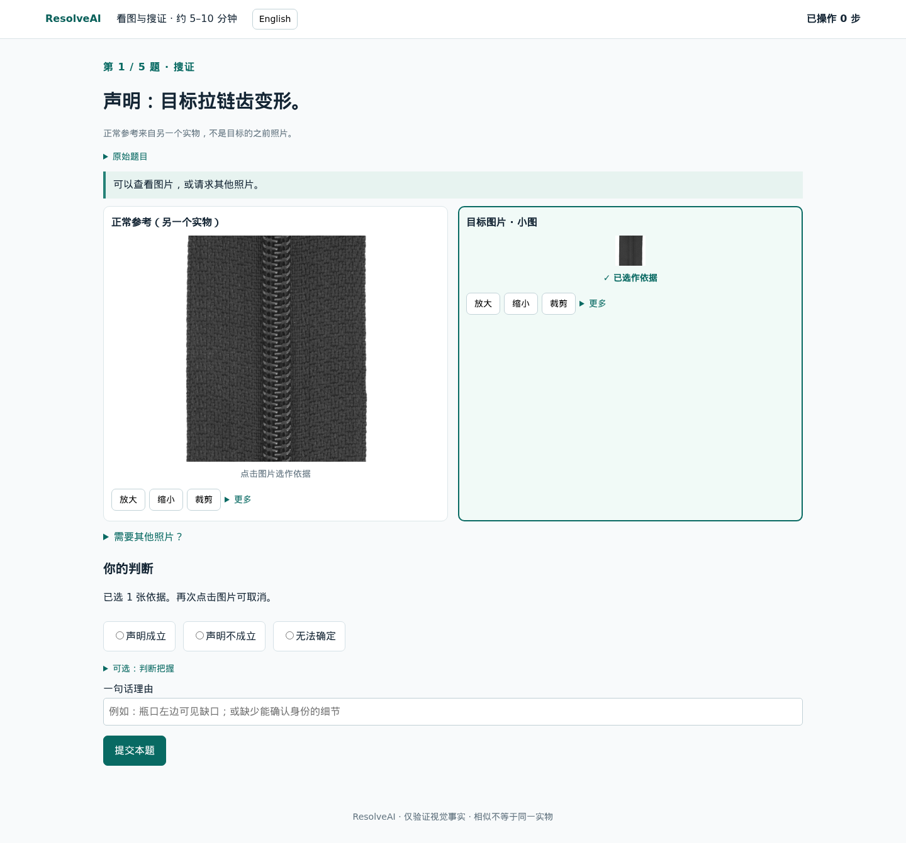

# 20 人短版人工实验

这次让人实际搜证，并独立检查“题目能不能判断、哪些图片足够”。每人预计 5–10 分钟：3 道搜证题、2 道分阶段审核题。人工任务不限时、不设点数、不限制操作次数；只记录用时和实际操作步数。共 20 人，不需要另外招募审核者。它是可用性和题目质量试验；样本量不足以支持人群层面的能力排名。

## 怎样发给参与者

[公开说明页](https://pathology-decision-solved-mood.trycloudflare.com) 已上线。个人邀请链接和研究者入口通过本次对话私下提供；公开说明页本身不能开始答题。服务任务 24958 当前计划运行至 **2026 年 10 月 9 日 00:16（美国东部时间）**。这是临时入口，重启后地址可能变化；邀请密钥和回答仍保存在 p62。

研究者入口可复制 20 条邀请链接。每人分配一条；不要多人共用，不要把研究者入口转发给参与者。参与者不用注册、填写姓名或上传图片。推荐电脑浏览器。顶部“中文 / English”按钮可切换全部界面、题目和提示，切换时保留选图与未提交理由；刷新后可继续已保存进度。当前公开地址和服务有效期由研究者提供；入口重启后可能改变，但 p62 上的回答保留。

可以原样发送：

> 请独立完成这个预计 5–10 分钟的图片判断实验。共有 5 道短任务；前 3 道可以按页面提示查看、放大、裁剪或请求照片，后 2 道是材料审核。有些题确实无法判断，选择“需要更多证据”完全可以。请只根据图片作答，不与其他人讨论。没有倒计时或操作次数限制，答案会自动保存。用电脑打开你的专属链接即可。

5–10 分钟是完成五题的预计用时，不是硬性上限。参与者可以慢慢看、反复操作，系统不会自动提交或跳题；未提交题保持未完成。旧界面的超时记录保留为历史数据，不会改写成人工答案。

## 人实际看到什么



[英文页面示例](demo/assets/human-study.en.png)

示例是一条明确的状态声明：“目标拉链的齿变形。”页面同时显示正常外观参考和目标照片。正常参考来自其他实物，不能当作同一物品的“之前照片”。参与者点击图片选作依据，再选择声明成立、不成立或无法确定，并简述依据。放大、缩小、裁剪直接在对应图片下面操作，不需要另选图片或操作下拉框；选图就是一种机制。标记区域和 OCR 等放在“更多”，无需每次填写。派生图片原位更新，不重复堆叠；“更多 → 恢复整图”可返回已释放整图。

- 放大／缩小：改变显示尺寸，不能把低分辨率预览恢复成原图。
- 裁剪：从已释放的原像素提取局部，保留来源和坐标。
- 比较：并排查看两张已获得的照片。
- OCR：从已释放图片识别文字；输出不是标注真值。
- 请求照片：展开“需要其他照片？”后直接点相应照片按钮，按所标物品、时点和视角返回材料或失败。不会默认替人请求关键材料。

截图是浏览器测试中另外选的一题，没有使用正式实验的回答或暴露正式邀请信息。图中 MVTec AD 图片按 [CC BY-NC-SA 4.0](https://creativecommons.org/licenses/by-nc-sa/4.0/) 使用；来源和像素校验记录见 [浏览器验证记录](results/human_web_smoke.json)。数据原作者与使用条件见 [MVTec 官方页面](https://www.mvtec.com/research-teaching/datasets/mvtec-ad)。截图内数据图片及其衍生展示采用该许可，代码许可与数据许可分别处理。

## 题目怎样采样

从 v0.4.1 全池 **478 个声明组合、1,912 个释放配置**抽样，先冻结名单，再看模型输出。全池的组合数量不等于独立实物数量。

抽取 20 个案件族：10 个状态声明（5 组相同明确标准的正负配对），10 个身份声明（4 组匹配的正负控制、2 个同类别身份未知候选）。身份未知候选允许审核后仍为 uncertain，不用来源标签强行判定同一实物。

其中 10 个案件族用于搜证，覆盖 6 个状态和 4 个身份声明。同一个案件族、同一个释放配置分别进入三种条件，每种有 2 人独立作答，共 **60 次搜证回答**：

| 条件 | 开始能看什么 | 能请求新照片吗 |
|---|---|---|
| 仅初始材料 | 初始图片 | 否 |
| 交互搜证 | 同样的初始图片 | 是 |
| 全部可获取材料 | 该版本允许获取的整个图片池 | 否 |

每人三种条件各做一题，顺序随机。每人另外审核两个不同案件族；全部 20 族各有 2 人审核，共 **40 份案件族审核**。同一人的五题不共享目标原图或多视角序列，也不会审核自己搜过的物品。实际用时、操作步数、请求失败和证据选择全部记录；不向人显示点数或倒计时。

## 怎样审核，避免看过原图后误判预览足够

每份审核按五个阶段依次释放图片；上一阶段的答案锁定后才能进入下一阶段：

1. 仅初始预览：是否足以判断，哪些已见图片是依据？
2. Missing／Unavailable 的可获取池：缺少指定原图时能否判断？
3. Sufficient 版本的初始材料：这一组是否足够？
4. 完整可获取池：能否得出确定结论？
5. 确认完整材料的结论、声明清晰度、替代解释和充分证据区域。

审核者看不到模型答案、另一人的票、来源标签或隐藏真值。支持身份声明通常需要两方的目标证据；状态声明的参考图不能单独支撑目标状态。两份独立审核通过一致性和证据规则后才准入；分歧、歧义和不足保留待审，不能强行赋确定标签。若需要后续仲裁，应另行记录，不混入这 20 人的初次盲审。

## 与模型评测怎样对应

已启动 Qwen3-VL-8B、Qwen2.5-VL-7B、InternVL3.5-8B。模型使用较大的冻结子集：96 个案件族 × 4 个释放配置 = 384 道配置；每个模型运行初始多图、全部可获取多图、交互 agent 三种模式，共 **1,152 条轨迹／模型，3,456 条总轨迹**。

人工抽取的 20 族全部包含在模型 96 族内。先报告审核通过的子集，再单列相同案件／释放配置的人机结果，不能用 96 族的来源标签冒充独立审核准确率。模型运行代码冻结于 `5dc8125`；网页后续改动不改变正在运行的模型脚本。此前 `human-study-v1` 的长版参与者安排未对外发放，仅复用其冻结模型题单。

人的核心工具是 inspect、crop、zoom、compare、OCR、request_photo；模型 agent 另有冻结模型 grounding 等工具。静态模型是直接看图，不是具有所有人类视觉操作的同工具策略。人工任务不限时、不限步数，模型仍按已冻结的预算评测。这次不能据此宣称工具与预算完全相同或直接比较人机延迟；人工主要用于验证可判断性、证据和操作可用性。

具体诊断分开看：

- 完整材料下，人也无法判断或意见不一致：优先改善题目、目标框和充分证据标注。
- 完整材料下，人一致能判断，模型仍失败：记录模型感知／身份匹配的能力证据。
- 人和模型完整材料都能判断，但交互模式未找到所需照片：检查请求接口、提示和模型搜证策略。
- 正确停止和确实缺证据的弃答单列；能请求但没有请求、无依据确定判断和接口错误分别报告。

## 运行与结果

服务在 GPU 节点 sclera 的 p62 上运行，网页本身使用 CPU；4 张 A6000 用于三个模型的四个评测 worker。图片、权重、邀请密钥、个人回答和轨迹留在运行目录，不提交 Git。网页不读取或公开模型轨迹。

```bash
python -m resolveai.human_study /private/human-study-short-v2 --port 8765
python scripts/analyze_human_study.py /private/human-study-short-v2 \
  /private/evaluation/human-study-v2 /private/new-analysis-snapshot
```

研究者入口提供进度、匿名回答和独立审核 JSONL 下载。分析脚本只对通过独立审核的题重新判分；没有审核时返回等待状态，静态模型没有证据引用时 grounded score 留空。输出必须写入一个新目录，避免覆盖既有分析。

软件检查覆盖超出原有时间、预算和操作次数后继续操作并刷新恢复。另用 Chromium 完整验证中英切换保留选图和理由、图片原位放大／裁剪／恢复、实际请求、三次搜证、两个五阶段审核、完成页面和研究者进度。浏览器测试使用临时合成回答，正式回答库没有写入测试票。结果质量仍需这 20 人实际完成后才能判断。

## 界面更新：2026-10-06

按参与者反馈改为直接点击图片选证与逐图操作，并取消所有人工计时、点数和步数上限。当前记录标记为 `human-ui-v3-unrestricted`；既有选题、邀请码和已保存回答不变。此前受限界面的回答保留原协议，分析时不能假定与新界面条件完全相同。顶部按钮支持中文／英语；英文题目使用原始英文声明，不通过即时机器翻译改写任务。
